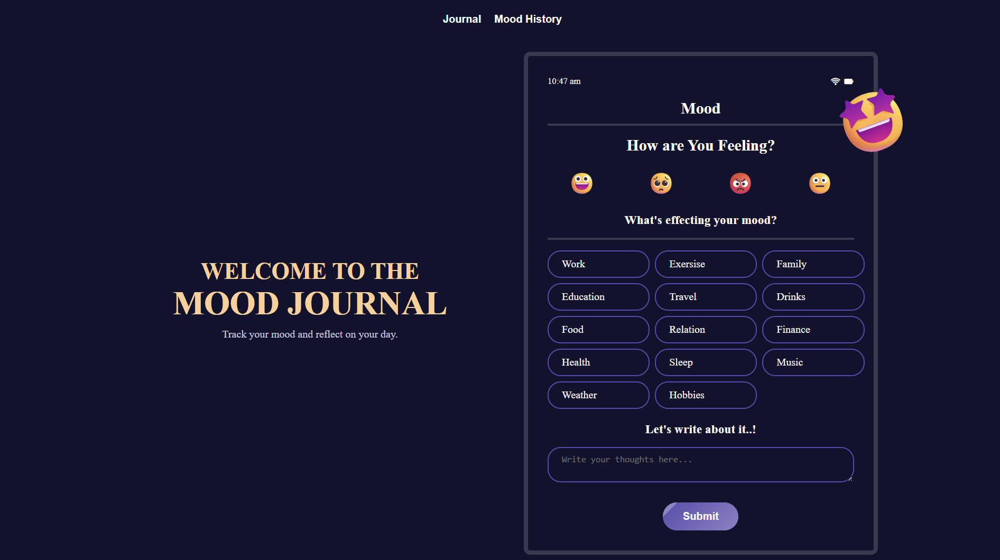

# 	😄 🥺  Mood Journal App 😡 😐

A simple and responsive web app to track your daily moods, reasons behind them, and your personal notes — built using **React**, **Vite**, and localStorage for data persistence.

## 🚀 Features

- 😄 Emoji-based mood selection (Happy, Sad, Angry, Neutral)
- ✍️ Write and save notes about your feelings
- 📋 Select multiple reasons for your mood (Work, Family, Food, etc.)
- 📅 View mood history with timestamps
- 🗑️ Delete individual entries or clear all history
- 📱 Fully responsive design for mobile, tablet, and desktop

## 🔧 Technologies Used

- React (with Hooks)
- Vite (for fast development)
- CSS3 with custom media queries
- localStorage for saving entries
- React Router for page navigation

## 📷 Screenshots

| Home Page | Mood History |
|-----------|---------------|
|  |  |
